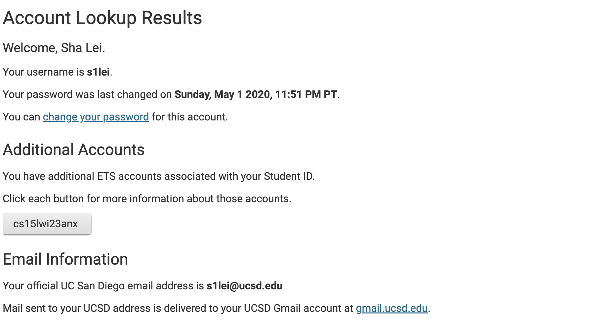
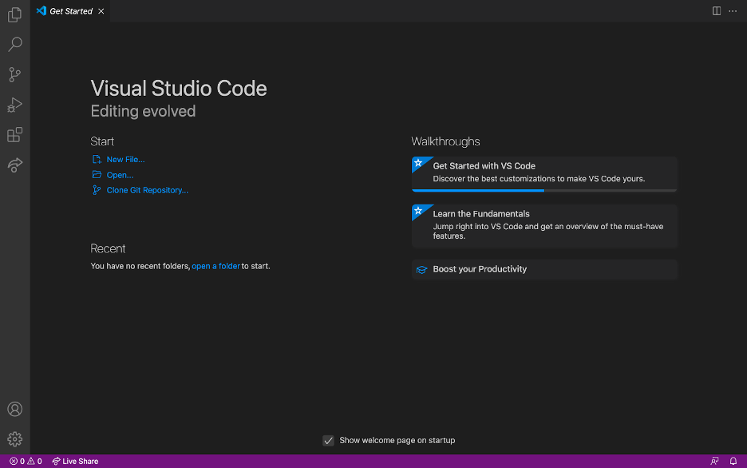
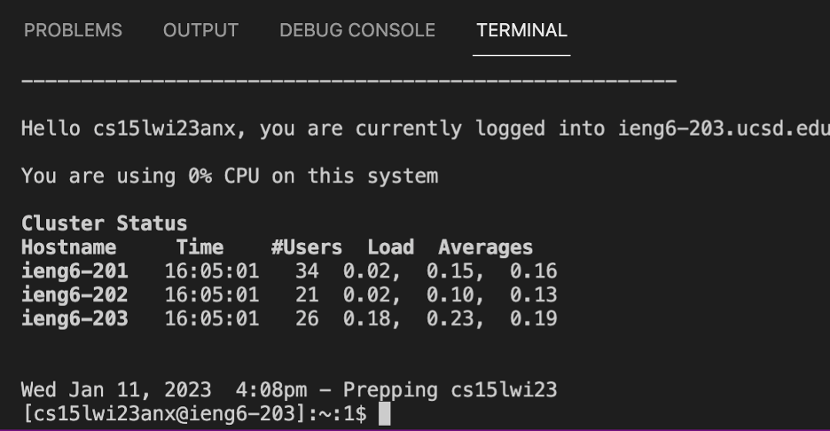
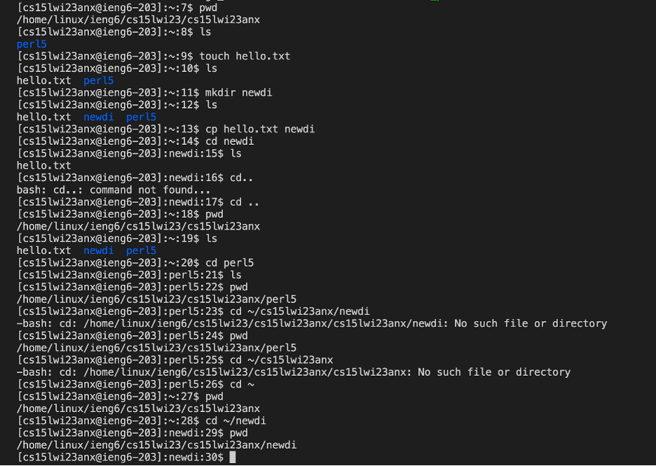

# Lab Report 1

**Hi! Welcome to my tutorial!**

This is a tutorial to help myself and readers build my own cse15l-related account on `ieng6` and clarify the process step by step.

The first step is a very imporant start!
### Step 1. Look Up your cse15l account on Website
In this step I go to this website: [https://sdacs.ucsd.edu/~icc/index.php](https://sdacs.ucsd.edu/~icc/index.php). 
Then by typing my personal info, this is what I get:

Then in this page, click on 
---
### Step 2. Installing Visual Studio Code
Since I already installed VS Code in other programming course. I can skip the installation part and go forward to open it.

This is how my VS code starter page look like:

---
### Step 3. Remotely Connecting To the Server
Because I'm using a MAC, so I can skip the part of installing `git bash`. Then 
1. I click on the `Terminal` on the top left bar menu, and choose open `New Terminal`.
2. Then in the terminal I type in `ssh cs15lwi23zz@ieng6.ucsd.edu`, and some message appears and let me type `yes` and give my own password if I want to continue connecting

Note*: the step about pressing password takes me the longest time, because resetting password takes relative long time, and actually it takes me about 20 minutes.

This is the message I get when I successfully connect to the server:

---
### Step 4. Try Combination of Commands
I try these commands together:

1. `pwd` always displays the full absolute path for the current working directory.
2. `ls` always list out the files in the current directory.
3. `touch` helps make a new file
4. `mkdir` creates a new child directory under current directory
5. `cp hello.txt newdir` copied the file `"hello.txt"` into directory `"newdir"`.
6. `cd ..`returns to the parent directory of the current directory
7. `~` can replace the part from begin to the part of my account, which is the path of log-in directory
---
In this lab, I learn about how to use terminal in Visual Code and some commands that can be used in the terminal.

That's the end of my tutorial!
